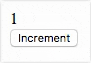

# make-element

make-element provides a simple and ergonomic system for creating Web Components. It is lightweight, imperative<sup>1</sup>,
supports Shadow DOM, and supports property/attribute binding.

## Example

### JS

```js
const CounterElement = makeElement({
    props: {
        counter: {
            init: 1,
            set(counter) {
                this.$['counter'].textContent = counter;
            },
        },
    },

    methods: {
        increment() {
            ++this.counter;
        },
    },

    ready() {
        this.$['increment-button'].onclick = () => {
            this.increment()
        };
    },

    shadowDom: true,
    template: `
        <div id="counter"></div>
        <button id="increment-button">Increment</button>
    `,
});

customElements.define('counter-element', CounterElement);
```

### HTML

```html
<counter-element></counter-element>
```

### Result



## API

### `makeElement(definition={})`

Produces a custom element class that can be passed to `customElements.define`.

#### `props`

Collection of properties to register for the custom element. All configuration fields (`attr`, `get`, `set`, &hellip;) are optional

##### `init`

Initial value of the property to use, unless the property is bound to an attribute with `attr` (e.g. `attr: 'foo'`) *and* initialized in markup (e.g. `<x-element foo="24"></x-element>`)

##### `attr`

*Default: (none)*

Attribute name to bind to

Every time the property is set, the value will flow into the attribute name specified here via `coerce()`, then `toAttr()`

A property can be initialised through markup by supplying an attribute value, but subsequent changes to the attribute will not flow back to the property -- binding is therefore **one-way from property to attribute**

###### Example

```js
myProp: {
    attr: 'my-attr',
}
```

```html
<my-element my-attr="24"></my-element>
```

```js
myElement.myProp;  // -> 24 (initialised from attribute)

myElement.myProp = 32;
myElement.getAttribute('my-attr');  // -> 32 (flowed from property)

myElement.setAttribute('my-attr', 48);
myElement.myProp;  // -> 32 (no change)
```

##### `get(val)`

Getter function called when the property is accessed

###### Example

```js
get(fullName) {
    const [firstName, lastName] = fullName.split(' ');
    return {firstName, lastName};
}
```

##### `set(val)`

Setter function called on every update to the property value

###### Example

```js
set(val) {
    console.log('property was set to', val);
}
```

##### `coerce(val)`

Function used to modify the property value before it is stored and passed to `set()`

###### Example

```js
coerce(val) {
    return Number.parseInt(val, 10);
}
```

##### `toAttr(val)`

Function used to modify the property value when storing into an attribute

##### `fromAttr(val)`

Function used to modify the attribute value if the property is initialized from the attribute

#### `methods`

Collection of methods to assign to the custom element prototype

##### Example

```js
methods: {
    myMethod() {
        console.log('hello from myMethod');
    },
}
```

```js
myElement.myMethod();  // -> hello from myMethod
```

#### `shadowDom`

*Default: `false`*

If true, shadow DOM will be used for templating

See [http://caniuse.com/#feat=shadowdomv1](http://caniuse.com/#feat=shadowdomv1)

#### `template`

HTML template to initialise the custom element with

If `templateUrl` is also defined, `template` will be used

#### `templateUrl`

Like `template`, but fetches the template from this URL

If `template` is also defined, `template` will be used

#### `cacheIds`

*Default: `true`*

If true, elements in the template with an `id` attribute will be stored in the `$` property for easy and fast referencing.

##### Example

```js
cacheIds: true,
template: `<p id="hello">hello</p>`,

ready() {
    this.$['hello'].onclick = () => {
        console.log('hello');
    };
},
```

#### `ready()`

Function invoked once the custom element has initialised its template and connected to the DOM

## License

MIT (see `license.txt`)

## Notes

1: For a functional-style custom elements library, see [skatejs](https://github.com/skatejs/skatejs)
